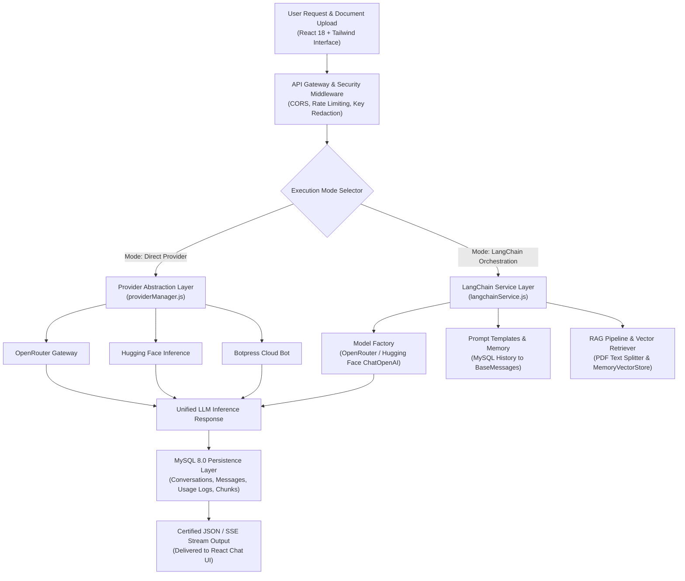
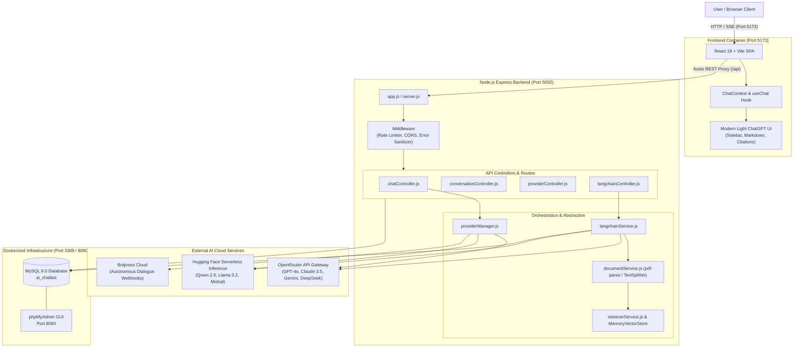
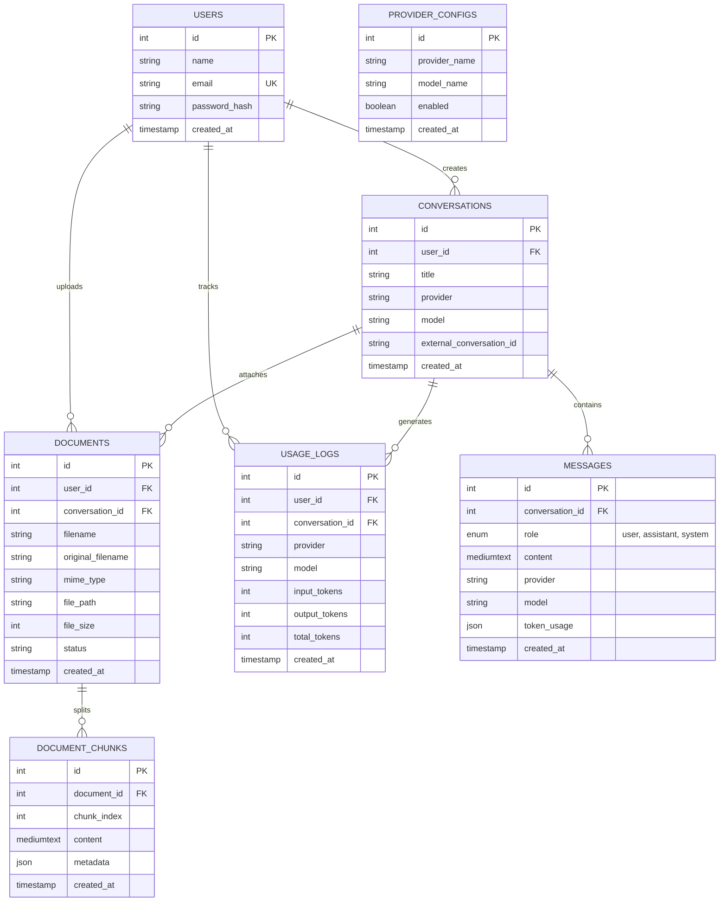

# OmniChat AI — Full-Stack Multi-Provider AI Chatbot & LangChain RAG Orchestrator

[](https://nodejs.org/)
[](https://expressjs.com/)
[](https://react.dev/)
[](https://vitejs.dev/)
[](https://tailwindcss.com/)
[](https://www.mysql.com/)
[](https://www.docker.com/)
[](https://js.langchain.com/)
[](https://openrouter.ai/)
[](https://huggingface.co/)
[](https://botpress.com/)

OmniChat AI is an enterprise-grade, full-stack conversational AI platform engineered with **React 18 (Vite)**, **Tailwind CSS**, **Node.js (Express)**, **LangChain.js**, and a containerized **MySQL 8.0** database stack managed via **Docker Compose** and **phpMyAdmin**. 

By unifying an extensible **AI Provider Abstraction Layer** with modern **LangChain.js Orchestration & Retrieval-Augmented Generation (RAG)**, OmniChat AI delivers dynamic multi-model flexibility, conversational memory persistence, automated document ingestion, vector similarity search, and zero-leak credential isolation.

- **GitHub Repository**: [https://github.com/Turjo101365/ai-chatbot-web](https://github.com/Turjo101365/ai-chatbot-web)
- **Frontend Web Client**: `http://localhost:5173` (or `http://localhost:5174`)
- **Backend REST API**: `http://localhost:5002/api`
- **API Health Endpoint**: `http://localhost:5002/api/health`
- **phpMyAdmin Dashboard**: `http://localhost:8090` (Credentials: `root` / `password123`)

---

## Why OmniChat AI?

Modern generative AI applications face significant architectural challenges:
1. **Vendor Lock-In**: Tying an application directly to a single model provider makes migrating between proprietary and open-source models costly.
2. **Secret Leakage in Single-Page Apps (SPAs)**: Direct browser calls to AI endpoints expose API keys in browser DevTools and network traces.
3. **Transient Memory & Hallucination**: Vanilla chat models hallucinate when answering questions about private documents without grounded context retrieval.
4. **Lack of Enterprise Governance**: Ad-hoc chat scripts fail to record token usage, request latencies, and persistent multi-user session histories in relational databases.

**OmniChat AI solves this through strict architectural separation of concerns**:
- **Zero-Secret Frontend**: The React SPA never receives, stores, or transmits upstream API tokens. All requests route through the backend gateway.
- **Provider Abstraction Layer**: The application speaks to a uniform internal interface (`providerManager.js`), decoupling business logic from upstream SDK variations across OpenRouter, Hugging Face, and Botpress.
- **Orchestration Without Provider Replacement**: LangChain.js operates strictly as an **orchestration layer** (prompt templates, MySQL memory conversion, document text chunking, and vector retrieval) while delegating actual model execution to the underlying providers.
- **ACID Persistence**: Conversations, message histories, token usage metrics, documents, and document chunks are persisted in Dockerized MySQL 8 with relational integrity.

---

## What OmniChat AI Does

- **Multi-Provider Dynamic Switching**: Seamlessly toggle between **OpenRouter** (GPT-4o, Claude 3.5, Gemini 2.0, DeepSeek, and free models), **Hugging Face Serverless Inference** (Qwen 2.5, Llama 3.2, Mistral 7B), and **Botpress Autonomous Bots**.
- **Dynamic Model Discovery**: Automatically queries available models from backend APIs, eliminating hardcoded model lists.
- **Retrieval-Augmented Generation (RAG)**: Ingests PDF, TXT, and Markdown documents, performs intelligent character chunking, calculates vector embeddings, and answers queries with explicit **Source Citations** (`{ document, page, snippet }`).
- **Relational Conversation Memory**: Syncs conversational turn history with MySQL, seamlessly converting database records into LangChain `HumanMessage`, `AIMessage`, and `SystemMessage` sequences.
- **Dual Execution Modes**:
  - `⚡ Direct Provider Mode`: Ultra-low latency, raw token streaming directly through provider SDKs.
  - `🧠 LangChain Mode`: Advanced orchestration with prompt templates, task selection (General Chat, RAG Document Q&A, Summarization), and vector grounding.
- **Modern Light-Themed ChatGPT Interface**: Clean minimalist UI with conversation history sidebar, search filter, inline conversation renaming, markdown rendering, syntax highlighting, and one-click code/response copying.
- **Enterprise Security & Rate Limiting**: Centralized error sanitizer with regex API key redaction, IP rate limiting via `express-rate-limit`, parameterized SQL queries preventing SQL injection, and granular CORS whitelisting.

---

## How It Works



---

## System Architecture



The system is organized into five modular, decoupled layers:

### 1. Presentation Layer (`src/`)
Built with **React 18**, **Vite**, and **Tailwind CSS**. It provides a light-themed, modern ChatGPT-like user experience:
- Collapsible sidebar with active conversation indicators, live client-side search filtering, inline renaming, and safe deletion modals.
- Full GitHub Flavored Markdown (`remark-gfm`) support with auto-language detection, highlighted code containers, and animated copy buttons.
- Document management widget supporting PDF, Markdown, and TXT drag-and-drop uploads with real-time chunk indicators.
- Source Citation drawer displaying grounded document page and text snippet cards underneath RAG responses.

### 2. API Gateway & Security Layer (`server/app.js`, `server/middleware/`)
- **IP Rate Limiting**: Global ceiling of 300 requests / 15 minutes, with a dedicated 60 requests / minute ceiling on `/api/chat` endpoints.
- **Zero Secret Leakage**: Strict regex error sanitizers intercept all outgoing HTTP 500 payloads, stripping API key patterns (`sk-or-v1-...`, `hf_...`) and raw stack traces.
- **Strict CORS**: Dynamic origin whitelisting supporting local Vite ports (`5173`, `5174`, `3000`).

### 3. Provider Abstraction Layer (`server/services/providers/`)
Encapsulates provider quirks behind a single signature:
```javascript
providerManager.sendMessage({ provider, model, messages, conversationId })
```
- **OpenRouter (`openrouterProvider.js`)**: Direct OpenAI SDK compatibility with dynamic model caching, cost calculation, and free-tier routing.
- **Hugging Face (`huggingfaceProvider.js`)**: Built on `@huggingface/inference` with automatic provider routing (`:fastest`), token counting, and custom model parameter overrides.
- **Botpress (`botpressProvider.js`)**: Communicates with Botpress Cloud Webhook APIs, maintaining Botpress external session IDs mapped to MySQL conversation records.

### 4. LangChain.js Orchestration & RAG Layer (`server/services/langchain/`)
Acts as an AI application layer without replacing the underlying LLMs:
- **`modelFactory.js`**: Dynamically instantiates LangChain `ChatOpenAI` models with OpenRouter endpoints or Hugging Face serverless backends.
- **`promptService.js`**: Standardized `ChatPromptTemplate` instances for General Chat, Strict Document-Grounded Q&A, and Context Summarization.
- **`memoryService.js`**: Loads conversation histories directly from MySQL `messages` table and converts them into LangChain `BaseMessage` arrays (`HumanMessage`, `AIMessage`, `SystemMessage`).
- **`documentService.js`**: Ingests uploaded PDFs (using `pdf-parse`) and text documents, dividing content using `RecursiveCharacterTextSplitter` (chunk size: 1,000 characters, overlap: 200 characters), and persisting chunk records in MySQL.
- **`retrieverService.js` & `ragService.js`**: Manages vector indexing in `MemoryVectorStore`, performs cosine similarity matching, constructs augmented prompts, and formats output answers with citation metadata.

### 5. Persistence & Telemetry Layer (`server/config/`, `server/models/`)
Operates on **MySQL 8.0** with connection pooling via `mysql2/promise`:
- Stores users, conversations, messages, documents, document chunks, provider configurations, and token usage logs.
- Automatic bootstrap schema migration runs on application start via `init.sql`.

---

## Supported AI Providers & Models

| Provider | Integration Type | Default / Featured Models | Characteristics |
|:---|:---|:---|:---|
| **OpenRouter** | API Gateway (`axios` / `@langchain/openai`) | `openai/gpt-4o`<br>`anthropic/claude-3.5-haiku`<br>`google/gemini-2.0-flash-exp:free`<br>`deepseek/deepseek-chat`<br>`nex-agi/nex-n2.5-mini:free` | Universal gateway supporting hundreds of LLMs with automatic fallbacks and free community models. |
| **Hugging Face** | Serverless Inference API (`@huggingface/inference`) | `meta-llama/Llama-3.2-3B-Instruct`<br>`meta-llama/Llama-3.1-8B-Instruct`<br>`mistralai/Mistral-7B-Instruct-v0.3`<br>`Qwen/Qwen2.5-72B-Instruct:fastest`<br>`microsoft/Phi-3.5-mini-instruct` | Open-source foundation models hosted directly on Hugging Face Serverless infrastructure. |
| **Botpress** | Autonomous Bot Webhook API | `default-assistant` | Full-stack conversational workflow platform with pre-configured bot autonomy and state machines. |

---

## LangChain.js RAG Pipeline Deep Dive

> [!IMPORTANT]
> **LangChain is an orchestration framework in this project. It does not replace the underlying LLM provider.**
> Hugging Face and OpenRouter remain the actual model inference providers.

```
Document File (PDF / TXT / MD)
              │
              ▼
1. Extraction & Parsing (documentService.js)
   - pdf-parse extracts raw page text and metadata
              │
              ▼
2. Intelligent Chunking (RecursiveCharacterTextSplitter)
   - chunkSize: 1000 characters | chunkOverlap: 200 characters
   - Chunks persisted into MySQL `document_chunks` table
              │
              ▼
3. Vector Indexing & Storage (retrieverService.js)
   - Chunks vectorized into MemoryVectorStore
              │
              ▼
4. Similarity Search (retrieverService.similaritySearch)
   - User query matches top-K relevant chunks (k=4)
              │
              ▼
5. Grounded Prompt Assembly (promptService.ragPrompt)
   - Strict system prompt enforces: "Answer ONLY based on the provided context."
              │
              ▼
6. Model Inference (modelFactory.js)
   - Selected model (e.g., Qwen2.5 or GPT-4o-mini) executes completion
              │
              ▼
7. Response Delivery & Source Citations
   - Emits structured response with text + source metadata:
     [{ document: "report.pdf", page: 2, snippet: "..." }]
```

---

## Database Schema (`ai_chatbot`)



---

## Safety and Reliability

- **API Key Containment**: API keys for OpenRouter, Hugging Face, and Botpress reside exclusively in backend environment variables. Neither raw keys nor tokens are stored in the database or serialized to the client.
- **Sanitized Error Payloads**: Unhandled exceptions are scrubbed by `errorHandler.js`. System secrets and database credentials are replaced with user-friendly error diagnostics.
- **SQL Injection Prevention**: All queries across MySQL models utilize prepared statements and parameterized bindings through `mysql2/promise`.
- **Defensive Fallback & Null Safety**: If an upstream provider experiences a temporary outage, the backend gracefully catches the timeout, preserves conversation state in MySQL, and returns actionable recovery instructions.
- **Docker Isolation**: MySQL and phpMyAdmin operate within isolated private container networks, exposing only mapped host ports with strict credential parameters.

---

## Environment Variables

Copy `.env.example` to `.env` in both the root directory and the `server/` directory:

```bash
cp .env.example .env
cp .env.example server/.env
```

| Variable | Required | Default | Meaning |
|:---|:---:|:---:|:---|
| `PORT` | No | `5002` | Node.js Express server listening port |
| `CLIENT_URL` | No | `http://localhost:5173` | Allowed frontend origin for CORS |
| `DB_HOST` | Yes | `127.0.0.1` | MySQL host address |
| `DB_PORT` | Yes | `3309` | MySQL host port (container maps internal 3306 -> 3309) |
| `DB_NAME` | Yes | `ai_chatbot` | Relational database schema name |
| `DB_USER` | Yes | `root` | MySQL administrative user |
| `DB_PASSWORD` | Yes | `password123` | MySQL root authentication password |
| `PMA_PORT` | No | `8090` | Docker host port for phpMyAdmin GUI |
| `OPENROUTER_API_KEY` | Optional | `""` | OpenRouter API token for gateway models |
| `OPENROUTER_MODEL` | No | `nex-agi/nex-n2.5-mini:free`| Default OpenRouter model |
| `HF_TOKEN` / `HF_API_KEY` | Optional | `""` | Hugging Face Access Token with `read` permission |
| `HF_MODEL` | No | `Qwen/Qwen2.5-72B-Instruct:fastest` | Default Hugging Face inference model |
| `BOTPRESS_BOT_ID` | Optional | `""` | Botpress Cloud Bot identifier |
| `BOTPRESS_API_KEY` | Optional | `""` | Botpress Personal Access Token / API Key |
| `BOTPRESS_WORKSPACE_ID` | Optional | `""` | Botpress Cloud Workspace identifier |

---

## API Reference

### 1. System Health Check
```http
GET /api/health
```
**Response (200 OK):**
```json
{
  "status": "ok",
  "environment": "development",
  "timestamp": "2026-09-28T10:45:00.000Z",
  "database": "connected",
  "providers": {
    "openrouter": true,
    "huggingface": true,
    "botpress": true,
    "langchain": true
  }
}
```

### 2. Unified Direct Chat Endpoint
```http
POST /api/chat
Content-Type: application/json
```
**Request:**
```json
{
  "provider": "openrouter",
  "model": "nex-agi/nex-n2.5-mini:free",
  "conversationId": 1,
  "message": "Explain quantum computing in simple terms."
}
```
**Response (200 OK):**
```json
{
  "success": true,
  "data": {
    "conversationId": 1,
    "userMessage": {
      "id": 12,
      "role": "user",
      "content": "Explain quantum computing in simple terms."
    },
    "assistantMessage": {
      "id": 13,
      "role": "assistant",
      "content": "Quantum computing uses quantum bits (qubits) that can exist as both 0 and 1 simultaneously...",
      "provider": "openrouter",
      "model": "nex-agi/nex-n2.5-mini:free",
      "tokenUsage": {
        "inputTokens": 18,
        "outputTokens": 45,
        "totalTokens": 63
      }
    }
  }
}
```

### 3. LangChain Conversational & RAG Query
```http
POST /api/langchain/chat
Content-Type: application/json
```
**Request:**
```json
{
  "conversationId": 1,
  "provider": "openrouter",
  "model": "nex-agi/nex-n2.5-mini:free",
  "message": "What does section 3 of our uploaded policy document state?",
  "task": "rag",
  "documentId": 4
}
```
**Response (200 OK):**
```json
{
  "success": true,
  "data": {
    "conversationId": 1,
    "model": "nex-agi/nex-n2.5-mini:free",
    "assistantMessage": {
      "id": 14,
      "role": "assistant",
      "content": "Section 3 outlines the data retention guidelines, requiring logs to be kept for 90 days.",
      "token_usage": {
        "inputTokens": 320,
        "outputTokens": 24,
        "totalTokens": 344
      }
    },
    "sources": [
      {
        "document": "security_policy.pdf",
        "page": 3,
        "snippet": "Section 3: Retention and Archival. All audit records must be retained for at least 90 calendar days."
      }
    ]
  }
}
```

### 4. Document Ingestion (Multipart Upload)
```http
POST /api/langchain/documents/upload
Content-Type: multipart/form-data
```
**Parameters:**
- `file`: Binary file (`.pdf`, `.txt`, `.md`)
- `conversationId`: (Optional) Associated conversation ID

**Response (201 Created):**
```json
{
  "success": true,
  "data": {
    "documentId": 4,
    "filename": "security_policy.pdf",
    "chunksCount": 8,
    "status": "processed"
  }
}
```

---

## Complete Project Structure

```
ai-chatbot-web/
├── docker-compose.yml           # MySQL 8.0 & phpMyAdmin multi-container setup
├── .env.example                 # Root environment template
├── .gitignore                   # Comprehensive secret & node_modules exclusion
├── index.html                   # Single-page web entrypoint
├── package.json                 # Frontend scripts and dependencies
├── package-lock.json            # Pinned frontend dependency lockfile
├── postcss.config.js            # PostCSS configuration for Tailwind
├── tailwind.config.js           # Design system tokens and styling rules
├── vite.config.js               # Vite build config & backend API reverse proxy
│
├── server/                      # Node.js Express Backend
│   ├── app.js                   # Express application middleware, routes & health check
│   ├── server.js                # Server entrypoint & port initialization
│   ├── package.json             # Backend dependencies (Express, LangChain, MySQL2)
│   ├── package-lock.json        # Pinned backend lockfile
│   │
│   ├── config/
│   │   ├── database.js          # MySQL connection pooling & auto-bootstrap
│   │   ├── env.js               # Safe environment variable validator
│   │   └── init.sql             # SQL schema DDL, indexes, and seed fixtures
│   │
│   ├── controllers/
│   │   ├── chatController.js         # Unified & direct chat request controllers
│   │   ├── conversationController.js # Conversation and message CRUD controllers
│   │   ├── providerController.js     # Provider catalog and model discovery
│   │   └── langchainController.js    # LangChain chat, RAG, and document handlers
│   │
│   ├── middleware/
│   │   ├── authMiddleware.js    # Session & user context injector
│   │   └── errorHandler.js      # Sanitized error handler with key redaction
│   │
│   ├── models/
│   │   ├── User.js              # User database operations
│   │   ├── Conversation.js      # Conversation SQL query bindings
│   │   ├── Message.js           # Message persistence & token counters
│   │   └── UsageLog.js          # Provider analytics and token usage logging
│   │
│   ├── routes/
│   │   ├── chatRoutes.js        # /api/chat route definitions
│   │   ├── conversationRoutes.js# /api/conversations route definitions
│   │   ├── providerRoutes.js    # /api/providers route definitions
│   │   └── langchainRoutes.js   # /api/langchain route definitions
│   │
│   ├── services/
│   │   ├── chatService.js            # Direct chat persistence & dispatcher
│   │   ├── conversationService.js    # Conversation management logic
│   │   │
│   │   ├── providers/                # AI Provider Abstraction
│   │   │   ├── providerManager.js    # Uniform provider orchestrator
│   │   │   ├── openrouterProvider.js # OpenRouter API gateway integration
│   │   │   ├── huggingfaceProvider.js# Hugging Face inference integration
│   │   │   └── botpressProvider.js   # Botpress conversational webhook
│   │   │
│   │   └── langchain/                # LangChain Orchestration & RAG
│   │       ├── langchainService.js   # Main LangChain workflow coordinator
│   │       ├── modelFactory.js       # Dynamic ChatOpenAI model instantiator
│   │       ├── promptService.js      # ChatPromptTemplate definitions
│   │       ├── memoryService.js      # MySQL message history to BaseMessages
│   │       ├── chainService.js       # Modern Runnable chain executor
│   │       ├── documentService.js    # PDF parsing & character text chunker
│   │       ├── embeddingService.js   # Embeddings calculation & adapter
│   │       ├── retrieverService.js   # Vector store & similarity search
│   │       └── ragService.js         # Document Q&A pipeline with citations
│   │
│   ├── uploads/                 # Temporary storage for ingested documents
│   └── utils/
│       └── responseParser.js    # Upstream token extractor and normalizer
│
└── src/                         # React 18 Frontend
    ├── main.jsx                 # Client mounting and root React DOM
    ├── App.jsx                  # React Router root layout
    ├── index.css                # Tailwind base styles and custom utilities
    │
    ├── components/
    │   ├── ChatWindow.jsx       # Main chat viewport, auto-scroll, empty states
    │   ├── ErrorMessage.jsx     # User-friendly error alert cards
    │   ├── LoadingIndicator.jsx # Animated generative typing indicator
    │   ├── MessageBubble.jsx    # Markdown renderer, code blocks, copy actions
    │   ├── MessageInput.jsx     # Auto-expanding text input with key listeners
    │   ├── ModelSelector.jsx    # Dynamic provider model dropdown
    │   ├── Navbar.jsx           # Top status bar, provider indicators, branding
    │   ├── ProviderSelector.jsx # Provider switch dropdown
    │   └── Sidebar.jsx          # ChatGPT-style conversation history sidebar
    │
    ├── context/
    │   └── ChatContext.jsx      # Global React state for chat and settings
    │
    ├── hooks/
    │   └── useChat.js           # Reusable hook for chat interactions
    │
    ├── pages/
    │   ├── Home.jsx             # Hero landing page with feature overview
    │   └── Chat.jsx             # Main conversational workspace
    │
    ├── services/
    │   └── api.js               # Axios REST client with interceptors
    │
    └── utils/
        └── helpers.js           # Text truncation, date formatting, badge colors
```

---

## Local Development & Setup

### Prerequisites
- **Node.js**: v20.0.0 or higher (v24 recommended)
- **Docker & Docker Compose**: Installed and active daemon
- **Git**

---

### Step 1: Clone Repository
```bash
git clone https://github.com/Turjo101365/ai-chatbot-web.git
cd ai-chatbot-web
```

### Step 2: Configure Environment Variables
Create the configuration file from the template:
```bash
cp .env.example .env
cp .env.example server/.env
```
Open `.env` and provide your API keys (at least one provider key is recommended):
```env
OPENROUTER_API_KEY=sk-or-v1-...
HF_TOKEN=hf_...
```

### Step 3: Launch Docker Infrastructure (MySQL & phpMyAdmin)
```bash
docker compose up -d
```
Verify containers are healthy:
```bash
docker ps
```
- **MySQL 8.0**: Port `3309` (Host) -> `3306` (Container)
- **phpMyAdmin**: [http://localhost:8090](http://localhost:8090) (User: `root`, Password: `password123`)

### Step 4: Install Dependencies & Launch Backend
Open a terminal in the project root:
```bash
cd server
npm install
npm run dev
```
Backend initializes on [http://localhost:5002](http://localhost:5002).

### Step 5: Install Dependencies & Launch Frontend
Open a second terminal in the project root:
```bash
npm install
npm run dev
```
Frontend client starts on [http://localhost:5173](http://localhost:5173).

---

## Verification & Testing

### 1. Verify API Health
```bash
curl -s http://localhost:5002/api/health | jq .
```
Expected output:
```json
{
  "status": "ok",
  "database": "connected",
  "providers": {
    "openrouter": true,
    "huggingface": true,
    "botpress": true,
    "langchain": true
  }
}
```

### 2. Test Live Model Completion (OpenRouter Free Model)
```bash
curl -s -X POST http://localhost:5002/api/chat \
  -H "Content-Type: application/json" \
  -d '{
    "provider": "openrouter",
    "model": "nex-agi/nex-n2.5-mini:free",
    "message": "What are three benefits of solar energy?"
  }' | jq .
```

### 3. Test Hugging Face Serverless Inference
```bash
curl -s -X POST http://localhost:5002/api/chat \
  -H "Content-Type: application/json" \
  -d '{
    "provider": "huggingface",
    "model": "Qwen/Qwen2.5-72B-Instruct:fastest",
    "message": "In 10 words or less, define machine learning."
  }' | jq .
```

### 4. Test RAG Document Ingestion
```bash
curl -s -X POST http://localhost:5002/api/langchain/documents/upload \
  -F "file=@README.md" | jq .
```

---

## Git Branching Strategy

This repository was constructed and versioned using a sequential feature-branch workflow:

| Branch Name | Primary Contribution |
|:---|:---|
| [`main`](https://github.com/Turjo101365/ai-chatbot-web/tree/main) | Production-ready full-stack release with complete documentation and architecture specs. |
| [`feature/docker-mysql-setup`](https://github.com/Turjo101365/ai-chatbot-web/tree/feature/docker-mysql-setup) | Multi-container Docker Compose stack, MySQL 8 DDL schemas, and initial fixtures. |
| [`feature/backend-api`](https://github.com/Turjo101365/ai-chatbot-web/tree/feature/backend-api) | Express server, MySQL database models, middleware, and conversation CRUD APIs. |
| [`feature/ai-providers`](https://github.com/Turjo101365/ai-chatbot-web/tree/feature/ai-providers) | Uniform provider abstraction layer for OpenRouter, Hugging Face, and Botpress. |
| [`feature/frontend-react-ui`](https://github.com/Turjo101365/ai-chatbot-web/tree/feature/frontend-react-ui) | Modern light-themed ChatGPT interface built with React 18, Vite, and Tailwind CSS. |
| [`feature/langchain-rag`](https://github.com/Turjo101365/ai-chatbot-web/tree/feature/langchain-rag) | LangChain.js orchestration, document parsing, text chunking, and RAG Q&A pipeline. |

---

## Team & Authors

- **Turjo** ([@Turjo101365](https://github.com/Turjo101365)) — Full-Stack Architecture, AI Provider Integrations, LangChain RAG Orchestration, and System Design.

---

## Acknowledgements

- [LangChain.js](https://js.langchain.com/) for runnable chain abstractions and document processing interfaces.
- [OpenRouter](https://openrouter.ai/) for universal multi-model gateway infrastructure.
- [Hugging Face](https://huggingface.co/) for open-source serverless inference hosting.
- [Botpress](https://botpress.com/) for autonomous bot conversational tools.
- [Tailwind CSS](https://tailwindcss.com/) & [Lucide Icons](https://lucide.dev/) for UI styling and icon assets.

---

## License

This project is licensed under the MIT License. Feel free to fork, customize, and extend for your own applications.

